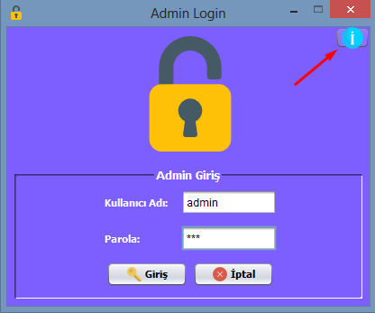
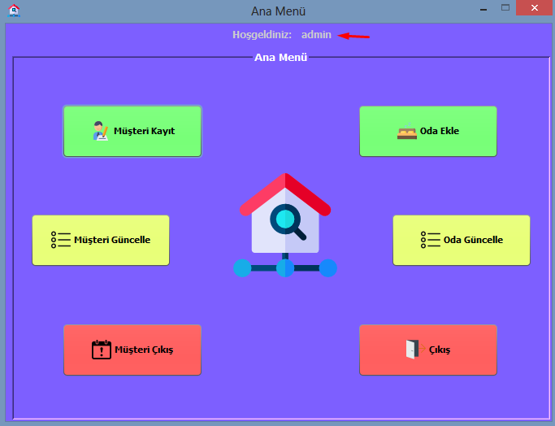
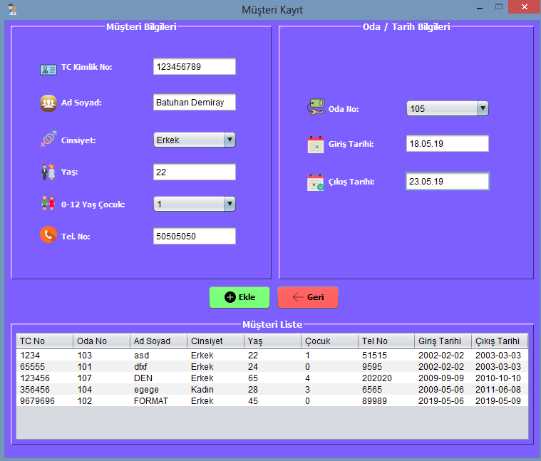
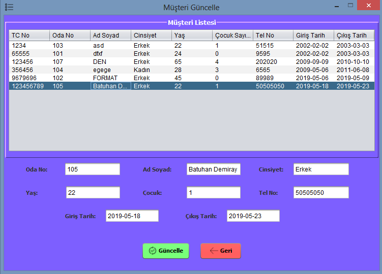
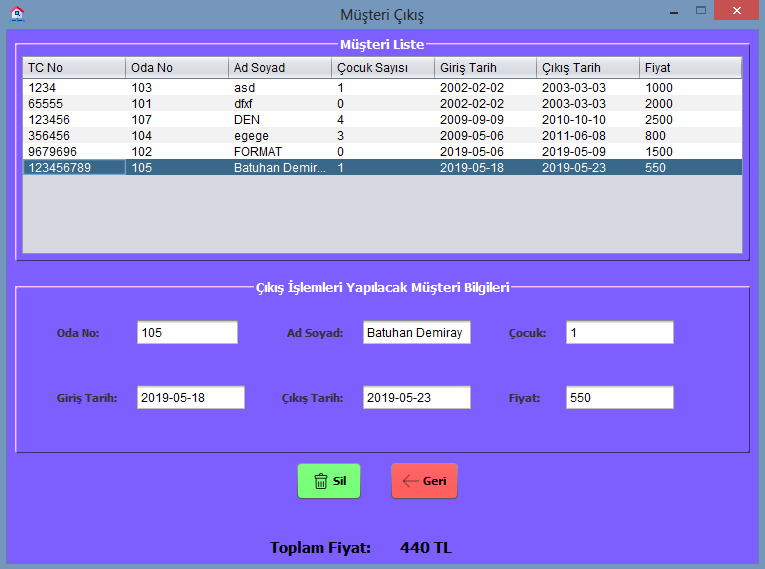
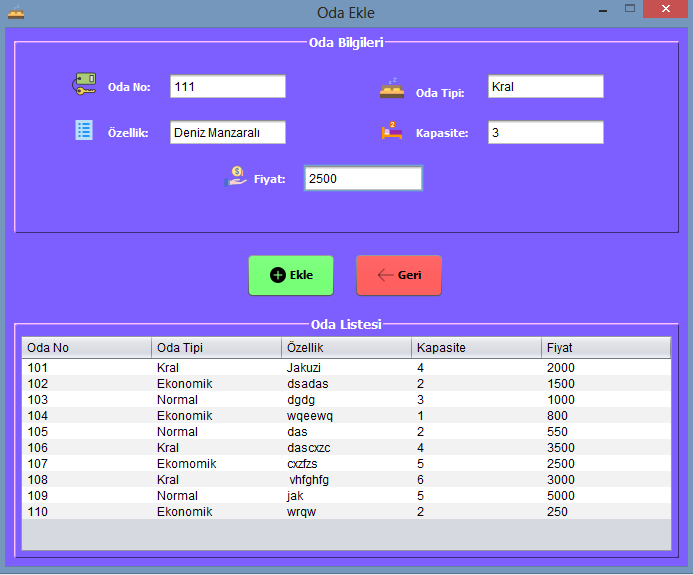
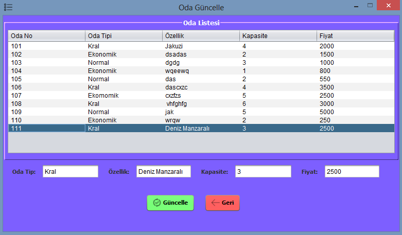

2018/2019 Yılı PAÜ Bilgisayar Mühendisliği bölümü

Nesneye Yönelik Programlama Proje Ödevi

w/ https://github.com/engincankizilyar

## LoginForm
 
Programımızın ilk açılışında bizi karşılayan ekran. Database’de halihazırda önceden tanımlanmış yetkili kullanıcı bilgileri ile giriş yapılabilen bir ekran aynı zamanda sağ üstteki “Info Button” tıklandığında developer isimlerini “MessageBox” şeklinde gösteriyor. 

## MenuForm
 
Login ekranından sonra yukarıda gördüğünüz gibi bir menü bizi karşılıyor. Müşteri Kayıt, Müşteri Güncelle, Müşteri Çıkış, Oda Ekle, Oda Güncelle gibi işlemleri yapabileceğimiz bu ekran sade ve kullanıcı dostu bir arayüz olmasıyla beraber kolay bir kullanış sunuyor. Aynı zamanda menünün üst kısmında yer alan “Hoşgeldiniz” kısmında ise bir önceki “Login” ekranında giriş yapan kullanıcının ismi yazıyor. 

## MusteriKayit
 
Müşterinin kaydının yapıldığı ekran. Üst taraftaki menüde müşteri bilgileri ve müşterinin kalacağı oda  ve tarih bilgileri girildikten sonra “Ekle” butonuyla beraber alt taraftaki “Müşteri Liste” de anlık olarak eklenilen müşteri görülecektir. Oda No yazan “ComboBox” Otel’de bulunan boş odaları listelemektedir yani böylece aynı odayı birden fazla müşteriye verme gibi bir sorun ortadan kalkacaktır. Aynı zamanda 0-12 yaş arası çocuk var ise girilecek, eğer yoksa yetişkin olarak kabul edilecektir. 

## MusteriGuncelle
 
Otelde bulunan tüm müşterileri listeleyen bir tablo ve altında da yukarıdaki tablonun “Clicked Event” i ile beraber bilgileri gösteren textbox’lar bulunmaktadır. Gerekli işlemler yapıldıktan sonra “Güncelle” butonu ile beraber işlem tamamlanıp, tablo anlık olarak güncellenecektir. 

## MusteriCikis
 
Müşteriyi silme ekranında yine tablonun “Clicked Event” i ile beraber bilgiler listelenir ve eğer ki 0-12 yaş arası çocuk 0’dan büyük ise odanın toplam fiyatı üzerinden %20’lik bir indirim uygulanır ve “label” a yazdırılır. 

## OdaEkle
 
Üst tarafta eklenecek odanın gerekli bilgileri girildikten sonra “Ekle” butonuyla beraber alttaki tabloda anlık olarak gösterilir. 

## OdaGuncelle
 
“MusteriGuncelle” ile aynı özellikleri taşıyan oda bilgilerini güncelleyeceğimiz ekran.
